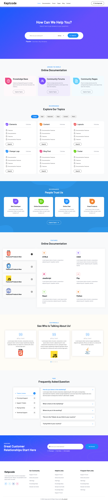

# Keptcode Demo template

## Language use

 - HTML
 - CSS : Bootstrap Utility Framework 
 - JavaScript : Slick Library, Jquery
 - Icon : Fontawsome, Boxicon
 
## Installation

Take this example.
```git
git clone https://github.com/suphawitz/Keptcode-Demo.git
```

## Template your project
[enter link description here]()

 - [Template this website](https://keptcode-demo.netlify.app)




## Thank you for coming to see.